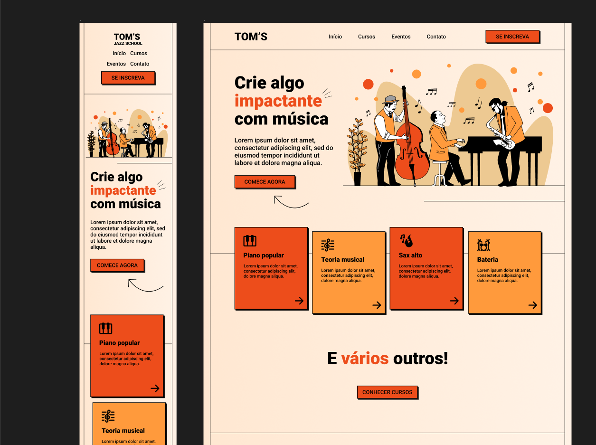

<h1> TOM's Jazz School </h1>

 Projeto criado com objetivo de aplicar estudo em HTML, CSS e JavaScript 

<a href="https://gabrielroldann.github.io/TOMs-Page/">Veja o funcionamento do site aqui</a>

 Template retirado do <a href="https://www.youtube.com/watch?v=Wo7UnH8TYbc">Youtube One Bit Code</a> e reproduzido por mim.

  <a href="#-tecnologias">Tecnologias</a>&nbsp;&nbsp;&nbsp;|&nbsp;&nbsp;&nbsp;
  <a href="#-projeto">Projeto</a>&nbsp;&nbsp;&nbsp;|&nbsp;&nbsp;&nbsp;
  <a href="#-layout-do-projeto">Layout</a>&nbsp;&nbsp;&nbsp;|&nbsp;&nbsp;&nbsp;
  <a href="#memo-licença">Licença</a>

## </> Tecnologias

Esse projeto foi desenvolvido com:

- HTML e CSS
- JavaScript
- Git e Github
- Figma

## Layout do Projeto

Visualização do layout do projeto:

- 
<a href="https://www.figma.com/file/76GJ4uK7PyKeAo6dcpVyjA/Tom's-Jazz-School?type=design&node-id=0-1&mode=design&t=JbxEqiop2L1DpPx5-0">Layout Figma.</a> 

## :memo: Licença

Esse projeto está sob a licença MIT.

---
